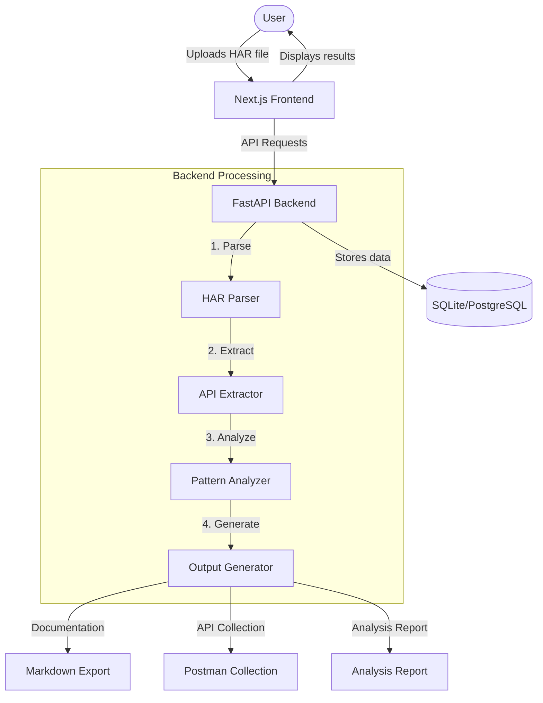
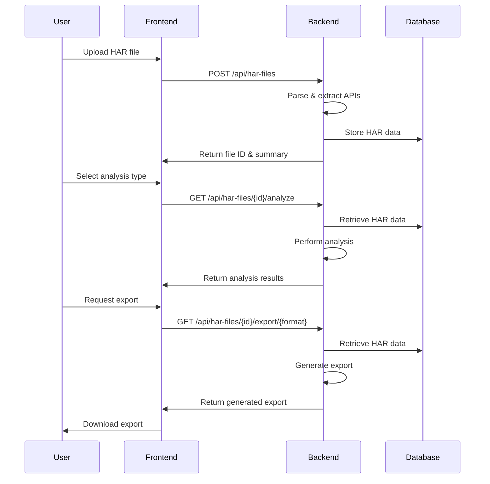

# HAR File Analyzer

A powerful tool for parsing, analyzing, and documenting HTTP Archive (HAR) files to extract valuable API insights. This application helps developers, QA engineers, and API designers understand API behavior, generate documentation, and debug web applications.

## What is HAR File Analyzer?

HAR File Analyzer is a comprehensive solution that transforms browser-generated HAR files into actionable API intelligence. HAR (HTTP Archive) files capture all network activity during a browser session, including API calls, request/response headers, timing data, and more. This tool helps you:

- Extract and organize API calls from complex web applications
- Generate instant API documentation
- Identify authentication patterns and required headers
- Analyze API usage patterns and similarities
- Export findings in multiple formats for integration with other tools

## Architecture



## Key Features

- **HAR File Upload & Management**: Securely upload and manage multiple HAR files
- **API Call Extraction**: Automatically identify and extract all API calls from the HAR file
- **Authentication Analysis**: Detect authentication patterns, tokens, and required headers
- **Pattern Recognition**: Identify URL patterns, query parameters, and request structure patterns
- **Similar API Detection**: Group APIs with similar patterns to understand resource hierarchy
- **Documentation Generation**: Create instant documentation from extracted APIs
- **Export Options**:
  - Markdown documentation for project wikis
  - Postman collections for API testing
  - Detailed analysis reports
- **RESTful API**: Integrate with your existing tools and workflows

## Deployment with Docker

### Prerequisites

- Docker and Docker Compose
- Git

### Quick Start

1. Clone the repository:
   ```bash
   git clone https://github.com/yourusername/har-file-analyzer.git
   cd har-file-analyzer
   ```

2. Create a `.env` file from the example:
   ```bash
   cp .env.example .env
   ```
   
3. Edit the `.env` file to set secure values for `SECRET_KEY` and `JWT_SECRET_KEY`.

4. Build and start the containers:
   ```bash
   docker-compose up -d
   ```

5. Access the application:
   - Frontend: http://localhost:3000
   - Backend API: http://localhost:8000
   - API Documentation: http://localhost:8000/docs

### Deployment on Coolify

1. Log in to your Coolify dashboard.

2. Create a new service and select "Docker Compose".

3. Configure the Git repository and branch.

4. Ensure the build context is set correctly.

5. Set the required environment variables (see below).

6. Deploy the application.

## Environment Variables

Key environment variables to configure:

| Variable | Description | Default |
|----------|-------------|---------|
| DEBUG | Enable debug mode | False |
| SECRET_KEY | Secret key for the application | Must be set |
| DATABASE_URL | SQLite or PostgreSQL connection string | sqlite:///./data/har_analyzer.db |
| JWT_SECRET_KEY | Secret key for JWT | Must be set |
| CORS_ORIGINS | List of allowed origins for CORS | ["http://localhost:3000"] |
| NEXT_PUBLIC_API_URL | URL for frontend to access API | http://localhost:8000/api |

## How It Works



## Development Setup

For development without Docker, follow these steps:

### Backend (FastAPI)

1. Install Python 3.10+ and Poetry.

2. Install dependencies:
   ```bash
   poetry install
   ```

3. Run the backend server:
   ```bash
   poetry run uvicorn src.main:app --reload --host 0.0.0.0 --port 8000
   ```

### Frontend (Next.js)

1. Navigate to the frontend directory:
   ```bash
   cd frontend
   ```

2. Install dependencies:
   ```bash
   npm install
   ```

3. Run the development server:
   ```bash
   npm run dev
   ```

## API Endpoints

The application provides the following key endpoints:

- `POST /api/har-files`: Upload a new HAR file
- `GET /api/har-files`: List all uploaded HAR files
- `GET /api/har-files/{id}`: Get details of a specific HAR file
- `GET /api/har-files/{id}/analyze`: Analyze a HAR file
- `GET /api/har-files/{id}/analyze/enhanced-patterns`: Get enhanced pattern analysis
- `GET /api/har-files/{id}/analyze/similar-apis`: Detect similar APIs
- `GET /api/har-files/{id}/export/markdown`: Export as Markdown documentation
- `GET /api/har-files/{id}/export/postman`: Export as Postman collection

For a complete API reference, visit the Swagger documentation at `/docs` when the server is running.

## Use Cases

- **API Discovery**: Understand how a web application interacts with its backend
- **Documentation Generation**: Create API documentation from actual usage
- **Testing Support**: Generate Postman collections for QA and testing
- **Debugging**: Analyze API calls to identify issues in web applications
- **Security Analysis**: Identify authentication patterns and potential vulnerabilities

## License

[MIT License](LICENSE)

## Contributors

- HAR Analyzer Team 